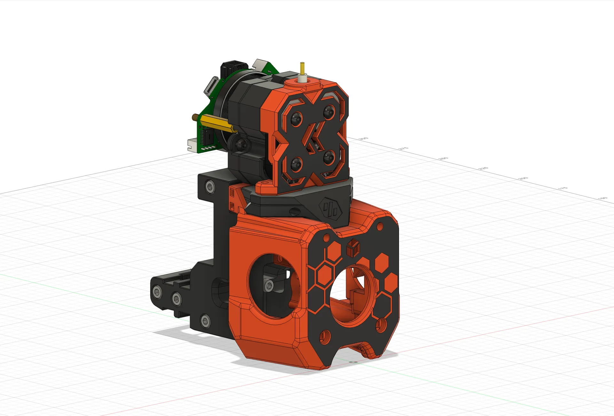
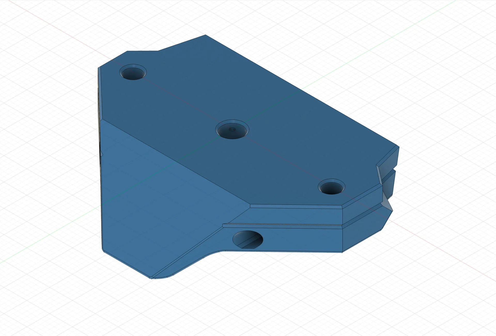
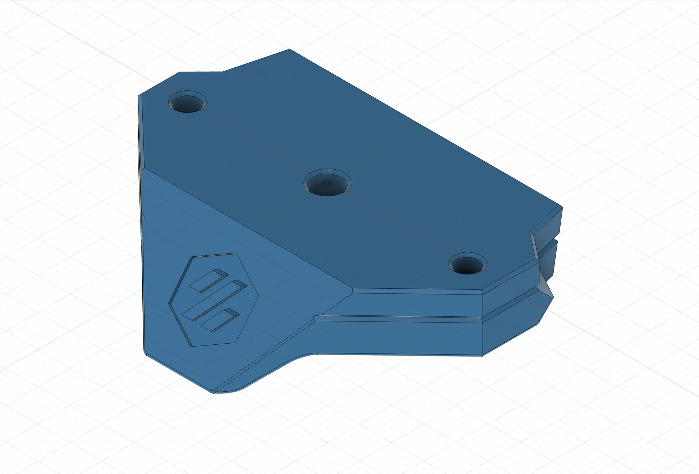
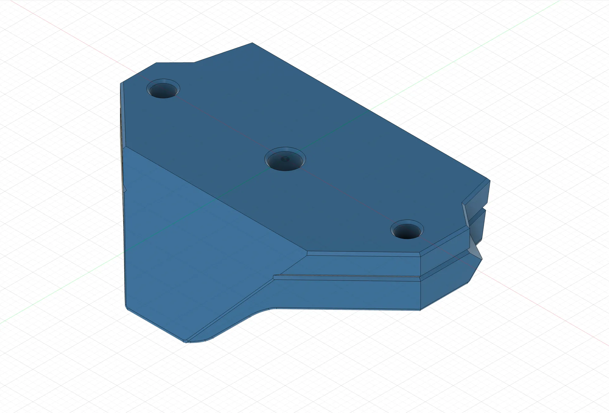

# A4T Papilio Extruder Adapter

A new toolhead that seems to be gaining popularity is [Armchair Engineering's A4T](https://github.com/Armchair-Heavy-Industries/A4T/). I decided I was going to try it out, but I realized that my extruder wasn't going to fit. I recently switched to [KevinAkaSam's Papilio Lite](https://kevinakasam.com/papilio/) extruder, and while it uses the same mounting holes as Sherpa Mini (Which A4T supports without an extruder adapter), the stepper motor on the rear won't clear the toolhead cowl.

I remixed the included adapter for LGX Lite, and made versions for both XOL and CW2/Tap carriages. 

I have not tested this with Papilio non-lite, but I don't see why it wouldn't work

There are versions for both XOL and CW2/Tap carriages, and each has a variant with or without the Voron logo

 

