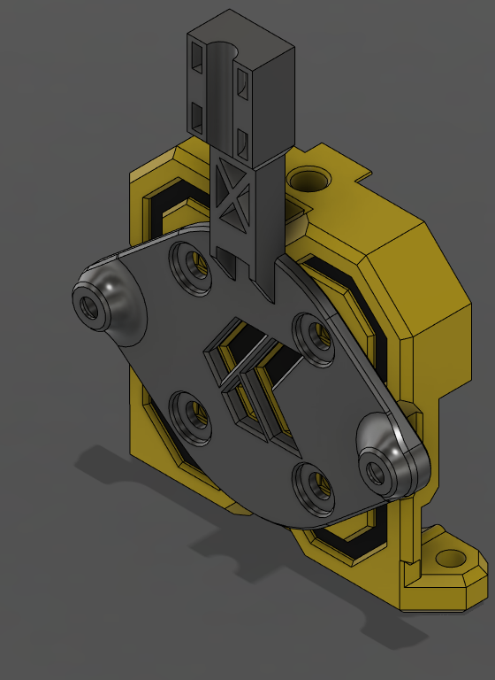

A front faceing mount for a EBB36 or similar for the Papilio Lite. You will need to replace the M3x20mm cover screws with M3x25mm BHCS to mount the mount to the PaplLite, 2 M3x4x5mm, and 2 M3x4mm or M3x6mm to secure the board to the mount.

