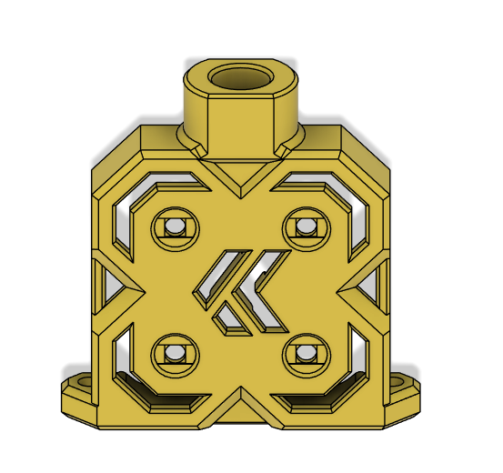

This front plate allows the collet that comes with the HGX Lite kit to be added at the top as a retainer for the bowden tube. Using a soldering iron, heat the metal ring and seat it in the top so that the end is either flush with the top face or just a bit higher, then insert the plastic retainer. **If the ring is inserted too far, there will not be enough space for the blue plastic lock ring.**

